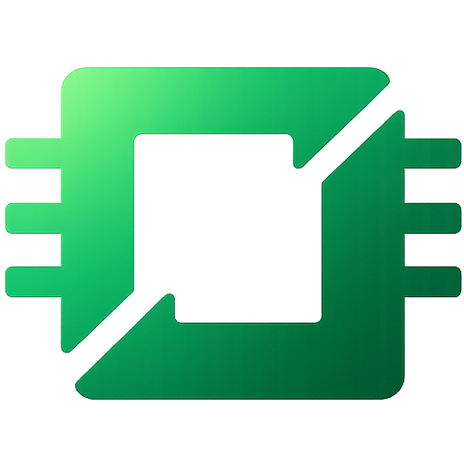

# Off Grid AI

### Intelligence should live on the devices you already own, with your full context, without handing your life to a cloud you don't control.

<b>BUILT BY</b>

<a href="https://wednesday.is/?utm_source=github&utm_medium=offgrid-org-readme&utm_content=logo"><strong>Wednesday Solutions</strong></a>

---

## Where Off Grid AI is headed

> A note from Mac to the community. None of it is fixed. I'd rather build this with you than for you.

The idea I keep coming back to: intelligence should live on the devices you already own, with your full context, without you handing your life to a cloud you don't control. Today, the most useful AI is the one that knows everything about you. Getting that usually means giving everything away. I don't think it should.

I didn't start with this thesis fully formed. It got clearer as I built, listened, and solved my own problems. Three of those problems became three pieces that are starting to fit together. This note is where Off Grid AI is actually headed.

---

## Three products, one ecosystem

These started as three separate apps. They're becoming one ecosystem. Same brand, three products that close the loop between your physical and digital life.

### Off Grid AI Mobile

[off-grid-ai/mobile](https://github.com/off-grid-ai/mobile)

Off Grid AI Mobile is on-device intelligence in your pocket. Chat, image, vision, voice, documents, all local. This is what you're using today.

It will also double as an opt-in offline recorder. Think AI meeting recorder, but for life, with all processing on device and nothing ever shared. What Off Grid AI Desktop does for your laptop, Off Grid AI Mobile does for your phone. Never forget anything ever again.

**Pro is live.** The free app is fully usable on its own; Pro unlocks the deeper layer (MCP connectors, skills, automation) for people who want to push it further.

[Google Play](https://play.google.com/store/apps/details?id=ai.offgridmobile) · [App Store](https://apps.apple.com/us/app/off-grid-local-ai/id6759299882)

### Off Grid AI Desktop

[off-grid-ai/desktop](https://github.com/off-grid-ai/desktop)

Off Grid AI Desktop is what My Memories becomes. My Memories came first, before Off Grid AI. It's a macOS app that watches relevant LLM windows and your browser, understands what each conversation is about, and stores it as memory. Your thinking across every model lives in one place that's yours, even after you switch tools.

It's grown well past that. Off Grid AI Desktop is now a full local-first AI studio: chat with vision and reasoning, on-device image generation, voice in and out, live artifacts, and projects you can ground in your own documents. Everything runs on a model you download, behind one local OpenAI-compatible gateway, so any app on your machine can use it as its private AI backend. No accounts, no API keys, nothing leaves the device.

On top of that runs the part I care about most: a layer that sees your day where you work (screen, meetings, the work context that makes everything else useful), remembers it, helps you reflect on it, and, with your approval, acts on it. The intelligence layer for your laptop.

**Pro is live.** The open build runs free on its own; Pro adds that sees / remembers / acts layer — screen capture, meetings, reflection, approvals and actions, skills automation.

### Off Grid AI Sync

[off-grid-ai/sync](https://github.com/off-grid-ai/sync)

Off Grid AI Sync is what Easy Share becomes. Easy Share solved a different itch: moving sensitive text and files between my own devices without a third party in the middle. Think AirDrop, but Android to macOS and back. Private, open source, no data collected. I built it because I needed it.

As Off Grid AI Sync it becomes the backbone that moves all of this between your devices, privately and seamlessly.

---

## When teams asked for it: Off Grid AI Console

[off-grid-ai/console](https://github.com/off-grid-ai/console)

The three products above are for you. Console is for the company you work in. The question enterprises kept asking wasn't "how do we stay private" — it was "our people are already using AI; can we see it, govern it, and trust what the agents do?" Putting agents in the hands of a workforce — and governing every call they make — is a deployment and governance problem, and that's the one Console solves.

Off Grid AI Console is the control plane for deploying AI agents across an organization, with the entire agentic stack baked in instead of stitched together. It governs a fleet of Off Grid devices from one place: push agents out to your field force, set the rules centrally, watch every run — while each device keeps running its models locally.

It's built as the five planes of agentic AI, with QA, grounding, evals, drift detection, and provenance running in-path on every request — not bolted on after:

- **Data** — connect your databases, warehouses, and SaaS; ingest into a private knowledge base with PII masking, cataloging, and retention/erasure.
- **Control** — the gateway as a single chokepoint: policy, model routing, guardrails, RBAC/ABAC, and an append-only audit log on every call.
- **AI** — the Brain: retrieval, grounding (does each claim follow from its cited source?), and a tool and agent registry.
- **Org / Regulatory** — live framework coverage, a governance registry, cost attribution by team and project, and one-click regulator/DPIA packs built from real evidence.
- **Consumption** — the agents themselves: pre-built use cases, each run traced end to end (plan → retrieve → ground → answer) with citations you can inspect.

And running across all of it: **Agent QA** — proof the agents are still doing a good job. Shipping an agent is the start, not the finish: models drift, prompts rot, retrieval degrades, and a system that was correct last month can quietly get worse. Agent QA answers "are they working, and if not, which one regressed and when?" across three lanes:

- **Offline evals** — golden-set recall plus promptfoo assertion matrices and Ragas RAG metrics, to regression-test agents before release.
- **Online scoring** — an LLM-as-judge scores live traffic for quality and faithfulness and trends it in Langfuse; a falling score is your alarm.
- **Drift & degradation** — population-stability plus Evidently test suites catch distribution shift and quality decay over time.

It runs in-path on every request, alongside OpenTelemetry traces and per-call cost — so quality is an ongoing production signal, not a one-time pre-release check.

It's modular and API-first, so a team can take just the Brain, just the agents, just the API, or the whole plane. And because every device still runs locally, you get all of this without your data leaving the company. This is how Off Grid AI pays for itself: the core stays open and free for individuals; organizations pay for the layer that deploys and governs agents at scale.

---

## How we build the intelligent layer

This isn't one of those open-ended agents you hand the keys to and hope it figures things out. Even the open-source ones running local models work that way. Ours is structured, with guardrails you set, so you stay in control. That structure is what makes the upside real instead of reckless.

I'll be honest about the timeline. This is a hard problem, even with AI in the loop. It will take time, and I'll get parts of it wrong before I get them right. I'd rather tell you that now than pretend otherwise.

---

## The deal, plainly

The core stays open. The integration that ties these three products together is open source and free. Everything runs on your device. No vendor lock-in, no data collected.

---

## Get involved

A lot of what's here exists because of feedback from the community. You've shaped this more than once already.

What would make this genuinely useful for how you actually work and live? Tell me.

[Join the Slack community](https://join.slack.com/t/off-grid-mobile/shared_invite/zt-3q7kj5gr6-rVzx5gl5LKPQh4mUE2CCvA)

— Mac

