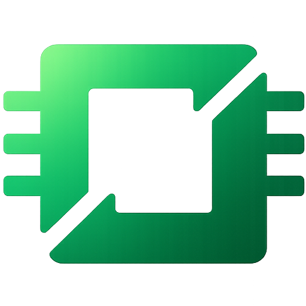

# Off Grid AI

Run AI on the devices you already own. Keep your models and personal data under your control.

Available across&nbsp; <picture><source media="(prefers-color-scheme: dark)" srcset="https://raw.githubusercontent.com/off-grid-ai/.github/main/profile/platforms/android-dark.svg"></picture> Android&nbsp;&nbsp; <picture><source media="(prefers-color-scheme: dark)" srcset="https://raw.githubusercontent.com/off-grid-ai/.github/main/profile/platforms/ios-dark.svg"></picture> iOS&nbsp;&nbsp; <picture><source media="(prefers-color-scheme: dark)" srcset="https://raw.githubusercontent.com/off-grid-ai/.github/main/profile/platforms/macos-dark.svg"></picture> macOS&nbsp;&nbsp; <picture><source media="(prefers-color-scheme: dark)" srcset="https://raw.githubusercontent.com/off-grid-ai/.github/main/profile/platforms/windows-dark.svg"></picture> Windows&nbsp;&nbsp; <picture><source media="(prefers-color-scheme: dark)" srcset="https://raw.githubusercontent.com/off-grid-ai/.github/main/profile/platforms/linux-dark.svg"></picture> Linux

 

<b>BUILT BY</b> <a href="https://wednesday.is/?utm_source=github&utm_medium=offgrid-org-readme&utm_content=logo">Wednesday Solutions</a>

---

## Our focus

We are building personal AI for consumers and working with design partners to improve it through daily use.

The goal is to make AI useful with your own documents, conversations, and tools, while you control what it can access and do. Local models run on your device. You choose which external tools to connect.

## Use Off Grid AI

### Off Grid AI Mobile (OGAM)

Chat, generate images, ask questions about photos, transcribe speech, and work with documents on your phone. Download a model and run it locally on Android or iOS.

The free app works on its own. Optional Pro features add voice replies, custom personas, and connected tools that prepare actions for your approval.

[Source code](https://github.com/off-grid-ai/OGAM) · [Google Play](https://play.google.com/store/apps/details?id=ai.offgridmobile) · [App Store](https://apps.apple.com/us/app/off-grid-local-ai/id6759299882)

### Off Grid AI Desktop (OGAD)

Use local AI on Linux, Windows, and macOS. Chat, create images, use voice, and work with your files. An OpenAI-compatible API lets other apps use your local models.

Optional Pro features add memory and tools to help with your work on supported platforms. You approve actions before they run.

[Source code](https://github.com/off-grid-ai/OGAD) · [Releases](https://github.com/off-grid-ai/OGAD/releases)

## One assistant across your devices

Pro includes Sync between paired devices. Keep your chats, projects, model settings, generated images, and attachments in step across Mobile and Desktop. Transfers are encrypted between your devices. No Off Grid AI server receives or stores the content you sync.

[See Pro features](https://getoffgridai.co/pro/)

## Build with us as a design partner

Run a business with fewer than 50 people? Work directly with us on a task or process you want to improve. Show us how you do the work today, test the solution, and give us feedback.

Setup and implementation are free. If we create a product based on your input, you get free lifetime access to that product. If your idea fits Off Grid AI, you get free lifetime Pro, even if we do not build the full solution together.

[Read the design partner offer](https://getoffgridai.co/design-partners/) · [Email us](mailto:design.partners@getoffgridai.co)

## Contribute

The source code is available in the product repositories. Report a problem, suggest a change, or open a pull request in the relevant repository.

[Website](https://getoffgridai.co/) · [Slack](https://join.slack.com/t/off-grid-mobile/shared_invite/zt-3q7kj5gr6-rVzx5gl5LKPQh4mUE2CCvA) · [Reddit](https://reddit.com/r/off_grid_ai)
